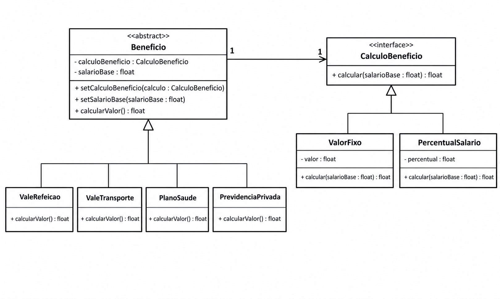

# Padrão de Projeto: Bridge (Sistema de RH)

Projeto em Java exemplificando a aplicação do padrão estrutural **Bridge** no contexto de Recursos Humanos para a disciplina DCC078-2026.3-A - Aspectos Avançados em Engenharia de Software.

## Diagrama de Classes UML

## Estrutura

- `Beneficio`: Classe abstrata que representa os benefícios e mantém a referência para a implementação do cálculo;
- `CalculoBeneficio`: Interface que define a forma de cálculo dos benefícios;
- `ValeRefeicao`, `ValeTransporte`, `PlanoSaude`, `PrevidenciaPrivada`: Classes concretas de benefícios;
- `ValorFixo`, `PercentualSalario`: Implementações concretas das formas de cálculo;
- Classes de teste específicas para cada benefício concreto.